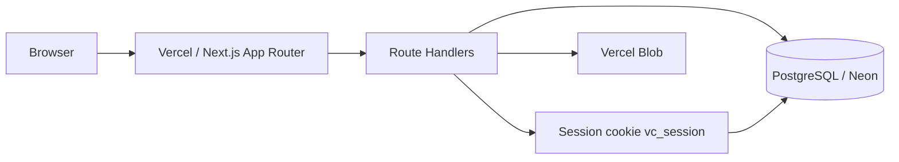

# Volunteer Connect — production architecture

This document describes the hosted architecture after the SQLite-to-Postgres migration. It does not claim scientific validity for match scores.

## 1. Architecture

- UI remains React App Router pages.
- Identity, roles, opportunities, applications, profiles, and organizations are server-authoritative.
- Client store (`components/prototype-store.tsx`) hydrates from APIs and keeps only UI state locally.

## 2. Entity relationship overview

- `users` 1—1 `profiles`
- `users` 1—1 `organizations` (employers)
- `users` 1—* `education` / `experiences` / `projects` / `achievements` / `skills` / `notifications` / `uploads`
- `skills` / `users` — `skill_verifications` (official flags only)
- `organizations` 1—* `opportunities`
- `opportunities` 1—* `applications` (unique `opportunity_id + student_id`)
- `users` *—* `opportunities` via `saved_opportunities`

## 3. API route inventory

| Method | Path | Purpose |
| --- | --- | --- |
| POST | `/api/auth/register` | Create student/employer |
| POST | `/api/auth/login` | Session cookie |
| POST | `/api/auth/logout` | Invalidate session version |
| GET | `/api/auth/me` | Restore session |
| PUT | `/api/auth/profile` | Save sanitized profile |
| POST | `/api/auth/password` | Change password + invalidate sessions |
| POST | `/api/auth/verify-email` | Confirm OTP |
| POST | `/api/auth/verify-email/send` | Issue OTP |
| GET/PUT | `/api/org` | Employer organization |
| GET | `/api/org/badges` | Public verified-org map |
| GET/POST | `/api/opportunities` | List / create |
| GET/PATCH/DELETE | `/api/opportunities/[id]` | Read / update / archive |
| GET/POST | `/api/employer/opportunities` | Employer list / publish |
| GET | `/api/employer/candidates` | Privacy-filtered applicants |
| GET/POST | `/api/applications` | List / apply / save |
| GET/PATCH | `/api/applications/[id]` | Read / withdraw or status |
| POST | `/api/uploads` | Store file |
| GET | `/api/uploads/[id]` | Owner/admin download |
| GET/POST | `/api/admin/verifications` | Review orgs |
| POST | `/api/admin/skills` | Official skill flags |
| GET | `/api/public/portfolio/[slug]` | Public/unlisted portfolio |

## 4. Authentication flow

1. Register or login verifies password with scrypt + `timingSafeEqual`.
2. Server sets httpOnly `vc_session` (HMAC, `SameSite=lax`, `secure` in production) including `sv` (session version).
3. Logout and password change increment `users.session_version`, invalidating older cookies.
4. `proxy.ts` and route guards load the live role from the database — never from the client.

## 5. Authorization matrix

| Action | Student | Pending employer | Verified employer | Admin |
| --- | --- | --- | --- | --- |
| Read open opportunities | Yes | Yes | Yes | Yes |
| Create/publish opportunity | No | No | Own org only | Yes |
| Edit/archive opportunity | No | No | Own org only | Yes |
| Apply / save | Self only | No | No | No |
| Withdraw application | Own only | No | No | Yes |
| Change application status | No | No | Own org apps | Yes |
| Read applicants | No | No | Own org only | Yes |
| Officially verify skills | No | No | No | Yes |
| Approve organizations | No | No | No | Yes |

Client-supplied `organizationId`, `role`, `verified`, and `skills[].verified` are ignored unless the session already authorizes the action.

## 6. Opportunity flow

1. Verified employer posts via `/api/employer/opportunities` or `/api/opportunities`.
2. Organization is taken from the session owner, not trusted client IDs.
3. Students list/search/filter open opportunities.
4. Delete archives the row (`status=archived`); it is hidden from the public list.

## 7. Application flow

1. Student POSTs `{ opportunityId, coverMessage? }` or `{ opportunityId, save: true }`.
2. Server rejects closed/expired opportunities and duplicate active applications (409).
3. Unique index prevents two active rows for the same student + opportunity.
4. Employer lists only applications to their organization.
5. Student PATCH may only set `withdrawn`. Employer cannot withdraw.

## 8. Matching logic

`lib/matching/score.ts` returns a **platform recommendation score** (18–98). It is not a scientifically validated psychometric model.

- Required-skill overlap up to 80 points (proficiency + official verification bonus).
- Career-interest overlap up to 12.
- Remote or location compatibility up to 8.

## 9. Deployment requirements

- Hosted PostgreSQL reachable from Vercel (Neon or Vercel Postgres recommended).
- `DATABASE_URL` on every serverless instance.
- Run `pnpm db:migrate` against the production database before the first deploy that needs the new schema. Never run `pnpm db:seed` in production.
- `AUTH_SECRET` required in production.
- `BLOB_READ_WRITE_TOKEN` required for uploads in production. Local `data/uploads` is development-only.
- Do not treat `data/volunteer-connect.sqlite` as production storage.

## 10. Environment variables

See `.env.example`.

| Name | Required | Notes |
| --- | --- | --- |
| `DATABASE_URL` | Yes | Postgres URL |
| `DATABASE_DRIVER` | Production: `postgres` | `pglite` is local-only; `neon` is an optional HTTP driver |
| `AUTH_SECRET` | Production | Session HMAC |
| `BLOB_READ_WRITE_TOKEN` | Production uploads | Vercel Blob |
| `ALLOW_DEMO_OTP` | No | Dev/demo only; ignored in Vercel Production |
| `BREVO_API_KEY` | Production email | Brevo API key |
| `EMAIL_FROM` | Production email | Verified sender address |
| `APP_URL` | Production email | Public origin for `/verify` links |
| `VOLUNTEER_CONNECT_DATA_DIR` | No | Local uploads only |

## 11. Migration instructions

Do this **before** pointing production traffic at a new empty database if you have local accounts to keep.

1. Back up `data/volunteer-connect.sqlite` (copy the file; do not delete it).
2. Provision Postgres and set `DATABASE_URL`.
3. `pnpm db:migrate`
4. `pnpm db:import-sqlite` — inserts users/orgs/profiles/verifications only when the email does not already exist.
5. `pnpm db:seed` — insert-if-absent demo accounts and catalog opportunities. Existing emails are left untouched.
6. Set Vercel env vars and redeploy.
7. Confirm demo or real users can log in, and that roles / email verification / org status match the source data.

## 12. Remaining known limitations

- Production email uses Brevo (`BREVO_API_KEY`, `EMAIL_FROM`). Until those are set on Vercel, verification emails will not be delivered.
- `ALLOW_DEMO_OTP` is ignored on Vercel Production. Do not set it there.
- Rate limits are PostgreSQL-backed (shared across instances) but not a Redis/Upstash limiter and not fully atomic under concurrent writes.
- Admin user/category screens still use prototype seed lists, not a users admin API.
- Notifications are stored, but there is no dedicated notifications API or scheduled worker.
- Match score is a heuristic recommendation only.
- Local filesystem uploads and PGlite are development-only and must not be used on Vercel.
- Catalog seed opportunities are attached to the EarthWise demo org. `pnpm db:seed` is refused in production.
- Hosted HTTP security tests have not been executed until `BASE_URL` points at the live Vercel deployment.

See `docs/deployment.md` for the Vercel checklist.
