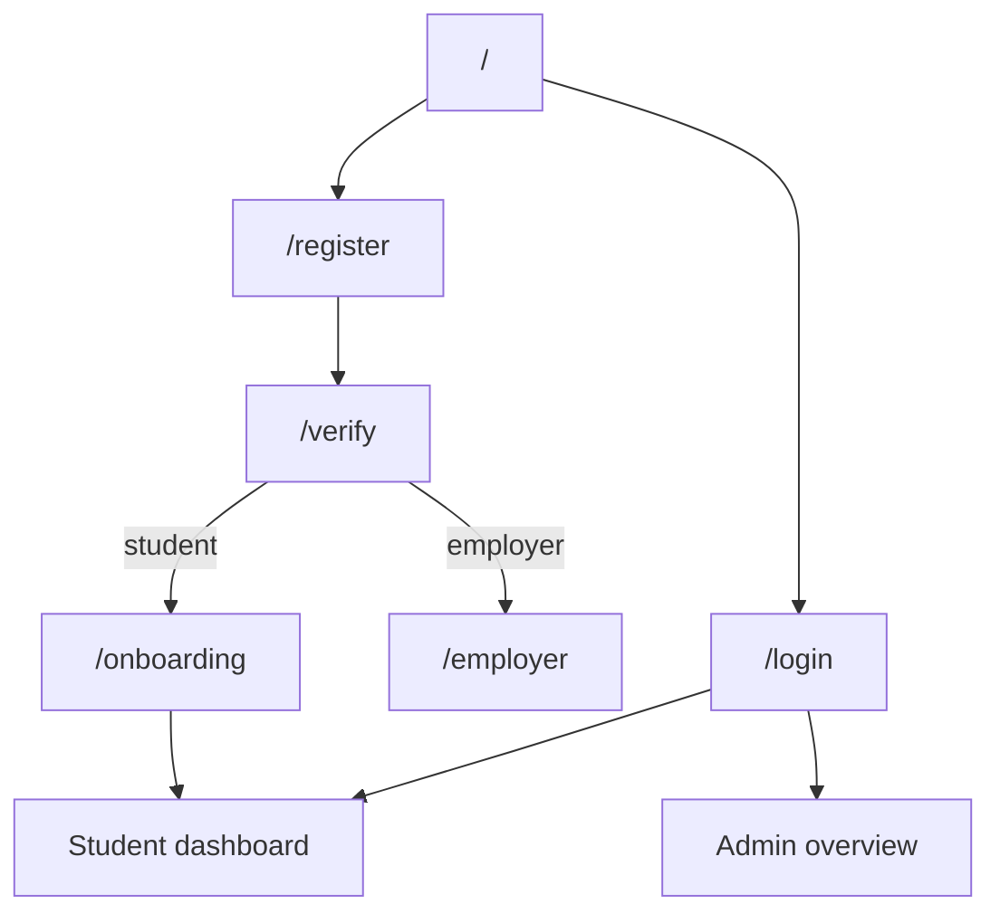
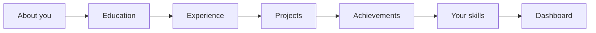
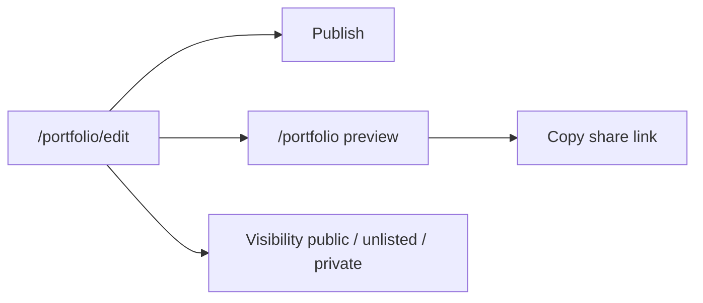
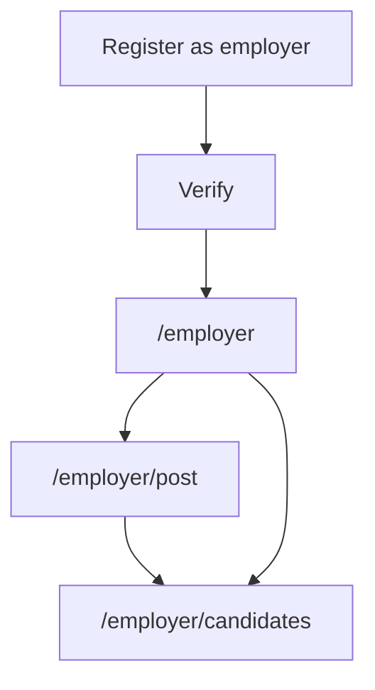

# 04 — User flows

Flows below match the prototype routes and `PrototypeProvider` actions. Production should keep the same steps and copy unless research says otherwise.

## Role map

---

## F1 — Marketing to first value (student)

**Entry:** `/`

1. User reads hero, How it works (5 steps), features, employer band.
2. **Get started free** → `/register` (role defaults to student).
3. **Explore a demo profile** → `/login`.
4. Employer CTA → `/register?role=employer`.

**Success:** User is on register or login. No auth required on marketing.

---

## F2 — Registration

**Entry:** `/register`  
**Actor:** Guest

1. Choose **Student** or **Employer** (`aria-pressed` cards). Query `?role=employer` preselects employer.
2. Complete name (or org name), email, password, confirm.
3. Client validation (see [05](./05-interaction-specifications.md)).
4. Submit → 650ms latency → `register({ name, email, role })`.
5. Redirect `/verify?next=/onboarding` (student) or `/verify?next=/employer`.

**Error paths**

| Condition | Message |
| --- | --- |
| Empty name | Please enter your name. |
| Empty / invalid email | Email is required. / Enter a valid email address. |
| `amara@example.com` | This email is already registered. Try logging in instead. |
| Password &lt; 6 | Use at least 6 characters. |
| Confirm mismatch | Passwords do not match. |

**Exit:** Verify. Account exists in memory, `verified: false`.

---

## F3 — Email verification

**Entry:** `/verify?next=…`  
**Actor:** Newly registered user

1. Six OTP cells. Demo code `481920`.
2. Paste fills all cells. Backspace moves left.
3. Submit → 700ms → accept demo code **or** last digit even.
4. Success screen 900ms → `verifyAccount()` → `router.push(next)`.
5. Resend: 30s cooldown, then “Code resent” for 2.5s (no real email).
6. **Skip for now** goes to `next` without verifying.

**Failure:** “That code doesn't match…” — stay on form.

**Production:** Real email/SMS OTP, expiry, rate limits, no even-digit bypass.

---

## F4 — Student onboarding (6 steps)

**Entry:** `/onboarding`  
**Skip:** Header **Skip for now** or per-step Skip → `/dashboard` (flags stay false).

Desktop stepper is clickable; completed steps show a check. Mobile shows progress bar + “Step N of 6” only.

| Step | Required to add a row | On continue |
| --- | --- | --- |
| 0 Basics | None (defaults headline to “Aspiring professional”) | `updateProfile`, `setOnboardingStep("basics")` |
| 1 Education | Institution + qualification | Optional add; skip allowed |
| 2 Experience | Role + organization | Type volunteer/internship/work; skill tags |
| 3 Projects | Title | Category school/community/personal |
| 4 Achievements | Title | Category award/certification/leadership |
| 5 Skills | None | Confirm detected skills (`level: 3`, `verified: false`) |

**Skill detection:** Unique skill names from experiences and projects, excluding skills already on the profile. Category inferred by keyword (`categorize()` in `onboarding/page.tsx`).

**Finish:** `setOnboardingStep("skills", true)` → `/dashboard`.

---

## F5 — Demo / returning login

**Entry:** `/login`

| Action | Result |
| --- | --- |
| Email `amara@example.com` + any password | `login()` → student demo data → `/dashboard` |
| Other email | Form error: use the demo account |
| Explore the demo profile | Same as Amara login (400ms) |
| Enter the admin console | `loginAsAdmin()` → `/admin` |
| Empty fields | Field errors |

Unknown emails never create a session. Production replaces this with real credentials + lockout.

---

## F6 — Student dashboard

**Entry:** `/dashboard`  
**Guard:** Logged-in student (any role can open it; employer/admin have their own homes).

Shows: greeting, profile strength + checklist, counts (education/experience/projects/achievements), top 3 matches, top 5 skills, CV/portfolio CTAs.

| Control | Destination |
| --- | --- |
| Generate CV / Build my CV | `/cv` |
| Checklist / stat tiles | `/profile` or `/profile?tab=…` |
| See all / Explore | `/opportunities` |
| Manage skills | `/profile?tab=skills` |
| View portfolio | `/portfolio` |

---

## F7 — Profile CRUD + evidence

**Entry:** `/profile`

1. Edit identity (modal): name, headline, location, about, comma-separated interests → `updateProfile` + mark basics complete.
2. Each section (Experience, Projects, Skills, Achievements, Education): Add opens a modal; Remove deletes the row.
3. Evidence chips display on experience/project/achievement rows (verified vs pending).

`?tab=` is used by dashboard links (`education`, `experience`, `projects`, `achievements`, `skills`). Sections have matching `id`s and `scroll-mt-24`.

**Production:** Edit-in-place, attach real files, request verification from a named referee.

---

## F8 — Skills analysis

**Entry:** `/skills`

- Empty → CTA to `/profile`.
- Else: totals, verified ratio, average proficiency, strongest category, category bars, demand gaps (skills on opportunities the user lacks, top 5), source list.

Read-only analysis. Mutations stay on Profile.

---

## F9 — CV generation

**Entry:** `/cv`

1. If no education/experience/projects/achievements → EmptyState → profile.
2. Template tabs: Modern (primary header band), Classic (3px foreground rule), Compact (tighter gap).
3. **Print** and **Export PDF** both call `window.print()`.
4. Body: Profile, Experience, Projects, Skills (✓ if verified), Achievements, Education.

**Production:** Server-side PDF (or print CSS + dedicated export), persist template on the user record, optional sections on/off.

---

## F10 — Portfolio publish

**Edit (`/portfolio/edit`):** theme (aurora / minimal / bold), visibility, slug (`vc.app/{slug}`, sanitized), tagline, show contact, show evidence. **Publish** sets `published: true`. **Preview** opens `/portfolio`.

**Preview (`/portfolio`):** Owner toolbar (draft/published chip, visibility, edit, share). Share copies `window.location.href` and shows “Link copied” for 2s. Public-style layout: hero, stats, experience, projects, achievements, education, skills sidebar.

**Privacy page** (`/settings/privacy`) can also set portfolio visibility plus discoverability toggles.

---

## F11 — Discover and apply

**List (`/opportunities`)**

1. Rank all listings by `matchScore`, filter by type chips, search title/org/skills.
2. Card actions: **View details** → `/opportunities/{id}`; **Quick apply** → apply modal; bookmark → status `saved`.
3. Empty search → EmptyState.

**Detail (`/opportunities/[id]`)**

- Meta, about, skill match vs gaps, related same-type listings.
- Apply modal: optional note → `setApplication(id, "applied")` → success.
- Save/unsave via bookmark.
- Unknown id → EmptyState.

**Apply modal (list or detail)**

- Shows match ring, description, required skills, “Applying as {name} — CV and portfolio attached”.
- Optional message (not persisted in prototype).
- If already applied/interview/offer → success state immediately.

---

## F12 — Applications pipeline

**Entry:** `/applications`

Empty → browse opportunities.

Else four columns: Saved, Applied, Interview, Offer. Prototype does not expose **rejected** in the board (status exists on the type). Cards are display-only; production should link to `/opportunities/{id}` and support drag-and-drop or explicit status changes (employer-driven).

---

## F13 — Notifications

**Entry:** `/notifications`

- Unread count in page subtitle and sidebar badge.
- Click row: `markNotificationRead` + navigate `href` if present.
- **Mark all as read**.
- Empty → EmptyState.

Kinds: match, application, verification, endorsement, system.

---

## F14 — Settings, privacy, help, logout

**Settings:** save name/email (2s “saved” confirm); password rules (current required, new ≥6, match); 2FA toggle is UI-only; delete account modal → `logout()` → `/`.

**Privacy:** searchable, show to employers, share analytics; portfolio visibility radios; email notifications + match alerts.

**Help:** accordion FAQ (one open); contact form subject + message → 3.5s success (no send).

**Logout:** sidebar / mobile icon → `logout()` → `/`. Clears all in-memory profile data.

---

## F15 — Employer

**Dashboard:** stats for listings with `providerId === "me"` (new posts only; seed listings have no provider). Empty → post CTA.

**Post:** title, org, type, location, remote, compensation, deadline, description, comma-separated skills → `postOpportunity` → success → post another or see candidates.

**Candidates:** hardcoded ranked list (Amara, Diego, Priya, Samuel). Open modal → **Contact** marks local `contacted` map. Production must query real applicants for the provider’s listings.

---

## F16 — Admin

**Entry:** Admin demo from login.

| Screen | Actions |
| --- | --- |
| `/admin` | Counts, recent sign-ups, taxonomy snapshot |
| `/admin/users` | Search, status filter, activate / set pending / suspend |
| `/admin/opportunities` | Search, type filter, confirm-remove modal |
| `/admin/categories` | Toggle active, add category |

`AppShell requiredRole="admin"` on opportunities and categories pages.

---

## F17 — Session reset and role gate

Any authenticated route without `loggedIn`/`user` (refresh) shows the session-reset card — not a hard redirect — so the prototype can explain in-memory limits.

Wrong role on `requiredRole` shows **Restricted area** and a button to that role’s home (`/admin`, `/employer`, or `/dashboard`).

---

## Deep links from dashboard checklist

| Flag | Label | Href |
| --- | --- | --- |
| basics | Complete your basics | `/profile` |
| education | Add your education | `/profile?tab=education` |
| experience | Add an experience | `/profile?tab=experience` |
| projects | Add a project | `/profile?tab=projects` |
| achievements | Add an achievement | `/profile?tab=achievements` |
| skills | Confirm your skills | `/profile?tab=skills` |

Implement scroll-to-section on `tab` in production if not already wired on first paint.
